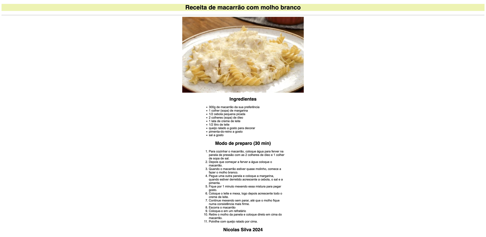

# Receita

## Sobre

Site simples com uma receita de macarrão ao molho branco. O objetivo desse projeto é iniciar o aprendizado nas linguagens de marcação HTML e CSS durante o curso técnico de Desenvolvimento de Sistemas do [SENAI Jandira](https://sp.senai.br/unidade/jandira/).

## Tecnologias utilizadas

- HTML
- CSS

## Autor

- Nicolas
